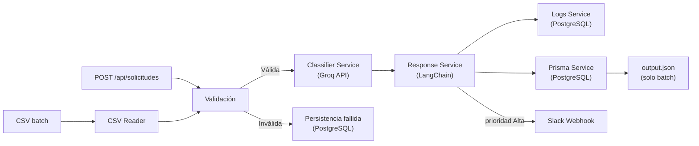

# Prueba Técnica TUMIPAY

Solución end-to-end para clasificar solicitudes de clientes y comercios usando IA, con dos modos de entrada: servidor HTTP en tiempo real y procesamiento batch por CSV. Persiste resultados en PostgreSQL, registra trazabilidad operativa en logs y envía alertas automáticas a Slack para solicitudes de alta prioridad.

---

## Descripción General

La solución tiene dos modos de entrada que comparten el mismo motor de procesamiento:

**Modo servidor HTTP** (`npm run start:server`):
1. Levanta un servidor REST en el puerto 3000.
2. Recibe solicitudes individuales por `POST /api/solicitudes` en tiempo real.
3. Valida, clasifica con Groq, genera respuesta con LangChain, persiste en PostgreSQL.
4. Devuelve el resultado estructurado como JSON.
5. Si la prioridad final es Alta, envía alerta automática a Slack.

**Modo batch por CSV** (`npm run process:csv`):
1. Lee un archivo CSV de entrada.
2. Valida campos mínimos obligatorios.
3. Ejecuta el mismo flujo de clasificación para cada fila válida.
4. Genera `datos/output.json` con el resumen del procesamiento.
5. Las solicitudes de Alta prioridad también disparan la alerta a Slack.

---

## Arquitectura



---

## Tecnologías Utilizadas

- **NestJS** — framework para estructurar servicios con inyección de dependencias
- **TypeScript** — tipado estático en todo el proyecto
- **Prisma ORM 7** — acceso a PostgreSQL con migraciones versionadas
- **PostgreSQL** — almacenamiento persistente (vía Docker Compose)
- **Groq API** — modelo `llama-3.3-70b-versatile` para clasificación y extracción
- **LangChain** (`@langchain/groq`, `@langchain/core`) — generación de respuesta sugerida por categoría
- **class-validator / class-transformer** — validación del body del endpoint REST
- **csv-parse** — lectura del CSV de entrada
- **js-yaml** — carga de prompts desde archivo YAML
- **Docker Compose** — entorno local de PostgreSQL reproducible

---

## Estructura del Proyecto

```text
src/
  api/
    solicitud.controller.ts   — endpoints REST
    solicitud.controller.spec.ts
    solicitud.dto.ts           — validación del body
  ingesta/
    csv.reader.ts
    csv.reader.spec.ts
  llm/
    classifier.service.ts
    classifier.service.spec.ts
    response.service.ts
    response.service.spec.ts
  logs/
    log.service.ts
    log.service.spec.ts
  notifications/
    slack.service.ts
    slack.service.spec.ts
  output/
    output.service.ts
    output.service.spec.ts
  prisma/
    prisma.service.ts
    prisma.service.spec.ts
  processor/
    processor.service.ts
    processor.service.spec.ts
  app.module.ts
  main.ts                      — entrypoint servidor HTTP
  cli.ts                       — entrypoint batch CSV
  cli.spec.ts
prompts/
  respuestas.yaml
datos/
  solicitudes.csv
  output.json
  output_ejemplo.json
prisma/
  schema.prisma
  migrations/
docker-compose.yml
```

---

## Prerequisitos

Antes de instalar, asegúrate de tener:

| Herramienta | Versión mínima | Cómo obtenerla |
|---|---|---|
| **Node.js** | 20.19.0 | [nodejs.org](https://nodejs.org) |
| **npm** | 10+ | Incluido con Node.js |
| **Docker Desktop** | Cualquier versión reciente | [docker.com/get-started](https://www.docker.com/get-started) |
| **Cuenta en Groq** | — | Crear cuenta gratis en [console.groq.com](https://console.groq.com) → *API Keys* → *Create API Key* |

> La API key de Groq es **gratuita** y no requiere tarjeta de crédito. El modelo `llama-3.3-70b-versatile` está disponible en el plan gratuito.

---

## Variables de Entorno

Archivo requerido: `.env` — ver ejemplo en [`.env.example`](./.env.example)

| Variable | Obligatoria | Descripción |
|---|---|---|
| `GROQ_API_KEY` | Sí | Clave de la API de Groq |
| `DB_HOST` | Sí | Host de PostgreSQL |
| `DB_PORT` | Sí | Puerto de PostgreSQL |
| `DB_USER` | Sí | Usuario de PostgreSQL |
| `DB_PASSWORD` | Sí | Contraseña de PostgreSQL |
| `DB_NAME` | Sí | Nombre de la base de datos |
| `DB_SCHEMA` | Sí | Schema de PostgreSQL |
| `GROQ_MODEL` | No | Modelo a usar (default: `llama-3.3-70b-versatile`) |
| `GROQ_TEMPERATURE` | No | Temperatura del clasificador — usar `0` para resultados deterministas (default: `0`) |
| `GROQ_RESPONSE_TEMPERATURE` | No | Temperatura de la respuesta sugerida — puede ser mayor para más variación (default: `0.3`) |
| `GROQ_MAX_TOKENS` | No | Tokens máximos de respuesta (default: `1000`) |
| `GROQ_MAX_RETRIES` | No | Reintentos ante fallo (default: `2`) |
| `PORT` | No | Puerto del servidor HTTP (default: `3000`) |
| `SLACK_WEBHOOK_URL` | No | URL del Incoming Webhook de Slack para alertas de prioridad Alta. Si se omite, las notificaciones se deshabilitan silenciosamente |

> **Nota sobre `prisma.config.ts`**: este archivo permite que el CLI de Prisma construya la URL de conexión desde las variables `DB_*`.

---

## Instalación

1. Instalar dependencias:

```bash
npm install
```

2. Configurar variables de entorno:

```bash
# En Linux/Mac:
cp .env.example .env

# En Windows (PowerShell):
Copy-Item .env.example .env
```

Abre el `.env` y completa el único valor obligatorio:

```env
GROQ_API_KEY=tu_api_key_de_groq
```

> El resto de variables ya tienen valores por defecto que funcionan con el Docker Compose incluido.

3. Levantar PostgreSQL con Docker:

```bash
docker compose up -d
```

Espera unos segundos hasta que el contenedor esté saludable. Puedes verificarlo con:

```bash
docker ps
```

El estado debe decir `healthy`.

4. Generar el cliente de Prisma:

```bash
npx prisma generate
```

5. Aplicar migraciones a la base de datos:

```bash
npx prisma migrate deploy
```

---

## Ejecución

### Modo servidor HTTP

```bash
npm run start:server
```

Inicia el servidor en `http://localhost:3000`.

#### Endpoints disponibles

| Método | Ruta | Descripción |
|---|---|---|
| `POST` | `/api/solicitudes` | Clasifica una solicitud individual en tiempo real |
| `GET` | `/api/solicitudes` | Lista todas las solicitudes procesadas |
| `GET` | `/api/solicitudes/:id` | Consulta una solicitud por su `id_solicitud` |

Filtro por estado:

```
GET /api/solicitudes?estado=procesada
GET /api/solicitudes?estado=requiere_revision_manual
GET /api/solicitudes?estado=fallida
```

#### Ejemplo de llamada

```bash
curl -X POST http://localhost:3000/api/solicitudes \
  -H "Content-Type: application/json" \
  -d '{
    "id_solicitud": "SOL-TEST-01",
    "fecha": "2026-06-08",
    "canal": "API",
    "tipo_cliente": "comercio",
    "nombre_cliente": "Tienda Demo",
    "mensaje": "Detecté transacciones duplicadas. Ya son 5 cobros por el mismo pedido en la última hora.",
    "prioridad_reportada": "baja"
  }'
```

#### Ejemplo de respuesta

```json
{
  "id_solicitud": "SOL-TEST-01",
  "categoria": "Conciliación / pagos",
  "prioridad_final": "Alta",
  "resumen": "El comercio reporta 5 cobros duplicados por el mismo pedido en la última hora",
  "datos_extraidos": {
    "cantidad_duplicados": 5,
    "tiempo": "última hora"
  },
  "respuesta_sugerida": "Estimado equipo de Tienda Demo, confirmamos que recibimos su reporte...",
  "estado_procesamiento": "procesada",
  "fecha_procesamiento": "2026-06-08T14:30:00.000Z"
}
```

> El ejemplo envía `prioridad_reportada: "baja"` pero el contenido describe pagos duplicados urgentes. El sistema asigna `prioridad_final: "Alta"` basándose en el mensaje, no en lo que reporta el cliente. Esto dispara una alerta automática a Slack si `SLACK_WEBHOOK_URL` está configurado.

#### Validaciones del endpoint POST

- `id_solicitud`: requerido, no puede estar vacío
- `mensaje`: requerido, no puede estar vacío
- `prioridad_reportada`: opcional; si se envía debe ser `alta`, `media` o `baja` (no distingue mayúsculas)
- Los demás campos son opcionales; si se omiten se tratan como cadena vacía

### Modo batch por CSV

```bash
npm run process:csv
```

```bash
npm run process:csv -- --file=./datos/solicitudes.csv
```

---

## Ejemplo de Entrada

Archivo: [`datos/solicitudes.csv`](./datos/solicitudes.csv)

Campos requeridos: `id_solicitud`, `mensaje`. Campos opcionales: `fecha`, `canal`, `tipo_cliente`, `nombre_cliente`, `prioridad_reportada`.

El CSV incluye 10 solicitudes de ejemplo que cubren todas las categorías y estados posibles, incluyendo una fila inválida (SOL-008, mensaje vacío) para demostrar el manejo de errores.

---

## Ejemplo de Salida

Archivo generado en cada ejecución: [`datos/output.json`](./datos/output.json)

Archivo de referencia estático: [`datos/output_ejemplo.json`](./datos/output_ejemplo.json)

Campos por solicitud:

| Campo | Descripción |
|---|---|
| `id_solicitud` | Identificador de la solicitud |
| `categoria` | Categoría asignada por el LLM |
| `prioridad_final` | Alta / Media / Baja (basada en el contenido, no en la reportada) |
| `resumen` | Resumen breve generado por el LLM |
| `datos_extraidos` | Información clave en JSON |
| `respuesta_sugerida` | Respuesta elaborada por LangChain según la categoría |
| `estado_procesamiento` | `procesada` / `requiere_revision_manual` / `fallida` |
| `fecha_procesamiento` | Timestamp del procesamiento |

---

## Uso del LLM

### Clasificación — Groq directo

El `ClassifierService` llama a Groq con el prompt de sistema de `prompts/respuestas.yaml` (clave `clasificacion`). El modelo devuelve un JSON con:

- `categoria` — una de las 6 categorías válidas
- `prioridad_final` — Alta / Media / Baja según el contenido real
- `justificacion_prioridad` — razonamiento de la prioridad asignada
- `resumen` — descripción breve
- `datos_extraidos` — información clave estructurada

**Regla clave del prompt:** la `prioridad_final` se basa en el contenido del mensaje, no en la `prioridad_reportada` por el cliente. Un mensaje que mencione fraude, transacciones no reconocidas o bloqueos urgentes siempre recibe prioridad Alta, aunque el cliente haya reportado "baja".

**Control de salida:** se eliminan bloques Markdown, se parsea el JSON, se valida contra los catálogos permitidos y se reintenta hasta `GROQ_MAX_RETRIES` veces. Si todos los intentos fallan, la solicitud se marca como `requiere_revision_manual`.

### Respuesta sugerida — LangChain

El `ResponseService` usa LangChain para generar una respuesta elaborada según la categoría clasificada. Selecciona el prompt correspondiente del YAML:

| Categoría | Clave del prompt |
|---|---|
| Soporte técnico | `soporte_tecnico` |
| Solicitud comercial | `solicitud_comercial` |
| Riesgo / fraude | `riesgo_fraude` |
| Conciliación / pagos | `conciliacion_pagos` |
| Actualización de datos | `actualizacion_datos` |
| Otro / requiere revisión manual | `revision_manual` |

Si LangChain falla, la solicitud igual se guarda como `procesada` con `respuesta_sugerida: null`.

---

## Almacenamiento

PostgreSQL con Prisma ORM. Migraciones versionadas en `prisma/migrations/`.

### Tabla `solicitudes`

Almacena datos originales del CSV y resultado del LLM: `categoria`, `prioridad_final`, `resumen`, `datos_extraidos` (JSONB), `respuesta_sugerida`, `estado_procesamiento`, `razon_fallo`, `fecha_procesamiento`. El campo `id_solicitud` tiene índice único — los `upsert` hacen el proceso idempotente.

### Tabla `logs_procesamiento`

Registra cada etapa del procesamiento: nivel (INFO/WARN/ERROR), etapa (INGESTA/CLASIFICACION/RESPUESTA/ALMACENAMIENTO), mensaje, prompt enviado al LLM, respuesta cruda recibida e intento número. Permite auditar exactamente qué decidió el modelo en cada solicitud.

---

## Integraciones

| Integración | Tipo | Uso |
|---|---|---|
| **Groq API** | API externa | Clasificación de solicitudes y extracción de datos con LLM |
| **PostgreSQL** | Base de datos relacional | Persistencia de solicitudes procesadas y logs operativos |
| **Slack Incoming Webhook** | Herramienta externa | Alertas automáticas cuando `prioridad_final === 'Alta'` |

---

## Manejo de Errores y Validaciones

| Situación | Comportamiento |
|---|---|
| Archivo CSV no existe | Falla con error descriptivo, detiene la ejecución |
| `id_solicitud` vacío | Fila marcada como `fallida`, el proceso continúa |
| `mensaje` vacío | Fila marcada como `fallida`, el proceso continúa |
| `prioridad_reportada` inválida | Fila marcada como `fallida`, el proceso continúa |
| LLM devuelve JSON malformado | Reintenta hasta `GROQ_MAX_RETRIES` veces |
| LLM devuelve categoría inválida | Reintenta hasta `GROQ_MAX_RETRIES` veces |
| Todos los reintentos fallidos | Solicitud marcada como `requiere_revision_manual` |
| Slack no disponible | Warning en consola, el procesamiento no se interrumpe |
| Mismo CSV ejecutado dos veces | Los registros se actualizan vía `upsert`, sin duplicados |

---

## Seguridad y Privacidad

### Lo que ya implementa esta solución

- Credenciales en variables de entorno (`.env`), nunca hardcodeadas ni subidas al repositorio (`.gitignore`).
- `.env.example` como contrato de configuración sin valores reales.
- Prisma ORM como única capa de acceso a datos — previene inyección SQL por diseño.
- Tabla `logs_procesamiento` separada de `solicitudes` para trazabilidad sin mezclar datos operativos con auditoría.
- Proceso idempotente: re-ejecuciones no generan duplicados ni exponen datos adicionales.

### Qué haría en un entorno fintech real

**Gestión de secretos:** reemplazar variables de entorno planas por un servicio dedicado como AWS Secrets Manager, HashiCorp Vault o GCP Secret Manager, con rotación automática periódica de claves.

**Cifrado:** cifrado en reposo en la base de datos (PostgreSQL con `pgcrypto` o cifrado a nivel de disco); TLS obligatorio en todas las conexiones de red, incluyendo la conexión a PostgreSQL.

**Datos personales en logs:** la tabla `logs_procesamiento` almacena el prompt enviado al LLM, que puede contener nombres, mensajes y datos del cliente. En producción, aplicaría enmascaramiento o tokenización de PII antes de escribir logs (`María Torres` → `M***T***`), en cumplimiento de la **Ley 1581 de 2012** (protección de datos personales en Colombia).

**Principio de mínimo privilegio:** el usuario de base de datos del pipeline tendría permisos únicamente de `SELECT`, `INSERT` y `UPDATE` sobre las tablas necesarias.

**Retención de datos:** políticas de expiración para registros de logs y solicitudes procesadas, evitando acumulación indefinida de datos sensibles.

**Infraestructura:** el pipeline correría dentro de una red privada (VPC), sin exposición pública directa de la base de datos ni del servicio.

---

## Cobertura de Tests

31 tests en 10 suites. Ejecutar con `npm test`.

| Suite | Qué valida |
|---|---|
| `csv.reader.spec.ts` | Separación válidas/inválidas, detección de campos vacíos, CSV vacío, archivo inexistente |
| `classifier.service.spec.ts` | Configuración desde env vars, parseo de JSON, reintentos ante respuesta inválida |
| `response.service.spec.ts` | Selección de prompt por categoría, configuración desde env vars |
| `log.service.spec.ts` | Persistencia de logs INFO/WARN/ERROR, metadatos extra, falla silenciosa de Prisma |
| `output.service.spec.ts` | Escritura del JSON final, estructura esperada |
| `processor.service.spec.ts` | Flujo completo con fila válida e inválida, upsert en Prisma, salida consolidada |
| `solicitud.controller.spec.ts` | POST con campos completos y opcionales, GET con y sin filtro, GET 404 |
| `slack.service.spec.ts` | Sin URL no llama fetch, body correcto, degradación silenciosa ante fallo de red |
| `prisma.service.spec.ts` | Prioridad de `DATABASE_URL` sobre variables individuales |
| `cli.spec.ts` | Resolución de `--file=`, argumento posicional, ruta por defecto |

---

## Limitaciones Conocidas

- No hay autenticación en el endpoint REST — en producción requeriría API keys o JWT.
- El pipeline extrae solo los 7 campos mínimos del CSV; columnas adicionales se ignoran. En producción se capturarían en un campo `metadata` para pasarlas como contexto al LLM.
- No hay colas ni procesamiento distribuido — el batch es secuencial con delay de 500ms entre solicitudes para respetar el rate limit de Groq.
- No hay panel administrativo para revisión manual de solicitudes clasificadas como `requiere_revision_manual`.

## Mejoras Futuras

- Panel de revisión manual para las solicitudes que el LLM no pudo clasificar.
- Cola de mensajes (RabbitMQ, SQS) para procesamiento distribuido y tolerancia a fallos.
- Enmascaramiento de PII en logs antes de persistir en base de datos.
- Tests de integración contra PostgreSQL real y Groq con credenciales de test.
- Autenticación del endpoint REST con API keys o JWT.

---

## Casos de Prueba

La carpeta `testcases/` contiene escenarios listos para ejecutar sin preparación adicional.

### CSV

| Archivo | Qué demuestra |
|---|---|
| `testcases/csv/fraude_y_riesgo.csv` | 4 solicitudes con `prioridad_reportada: baja` cuyo contenido describe fraude — el sistema debe asignar `Alta` en todas y disparar alertas Slack |
| `testcases/csv/todas_categorias.csv` | Una solicitud de cada categoría con canales y tipos de cliente variados |
| `testcases/csv/validaciones_errores.csv` | Mix de filas válidas e inválidas (sin `id_solicitud`, sin `mensaje`, prioridad fuera del catálogo) |

```bash
npm run process:csv -- --file=./testcases/csv/fraude_y_riesgo.csv
npm run process:csv -- --file=./testcases/csv/todas_categorias.csv
npm run process:csv -- --file=./testcases/csv/validaciones_errores.csv
```

### API

Con el servidor corriendo (`npm run start:server`), importar `testcases/api/postman_collection.json` en Postman (`Ctrl+O` o arrastrar el archivo).

La colección incluye 5 solicitudes de procesamiento, 3 validaciones que deben retornar HTTP 400 y 5 consultas GET.

---

## Comandos Útiles

| Comando | Descripción |
|---|---|
| `npm run start:server` | Iniciar servidor HTTP |
| `npm run process:csv` | Procesar CSV por defecto |
| `npm run process:csv -- --file=ruta` | Procesar CSV específico |
| `npm run build` | Compilar TypeScript |
| `npm test` | Ejecutar todos los tests |
| `npm run test:cov` | Tests con cobertura |
| `npm run prisma:studio` | Abrir Prisma Studio (visor de BD) |

---

## Checklist de Cumplimiento

| Requerimiento | Estado | Dónde |
|---|---|---|
| Ingesta desde fuente estructurada | ✅ | `datos/solicitudes.csv` + `src/ingesta/csv.reader.ts` |
| Validación de campos mínimos | ✅ | `src/ingesta/csv.reader.ts` + `src/api/solicitud.dto.ts` |
| Clasificación con LLM | ✅ | `src/llm/classifier.service.ts` (Groq) |
| Extracción de información clave | ✅ | Campo `datos_extraidos` en el JSON del clasificador |
| Respuesta sugerida | ✅ | `src/llm/response.service.ts` (LangChain) |
| Todas las categorías mínimas | ✅ | `prompts/respuestas.yaml` |
| Prioridad final independiente | ✅ | Prompt de clasificación con reglas explícitas |
| Persistencia en BD relacional | ✅ | PostgreSQL con Prisma + migraciones |
| Integración real | ✅ | Groq API + PostgreSQL + Slack webhook (3 integraciones) |
| Logs y trazabilidad | ✅ | Tabla `logs_procesamiento` + consola |
| Manejo de errores y reintentos | ✅ | `ClassifierService` con retry, estados separados |
| Variables de entorno para secretos | ✅ | `.env` + `.env.example` |
| README completo | ✅ | Este documento |
| Archivo de entrada de ejemplo | ✅ | `datos/solicitudes.csv` |
| Archivo de salida de ejemplo | ✅ | `datos/output_ejemplo.json` + `datos/output.json` |
| Entorno reproducible | ✅ | `docker-compose.yml` + instrucciones paso a paso |
